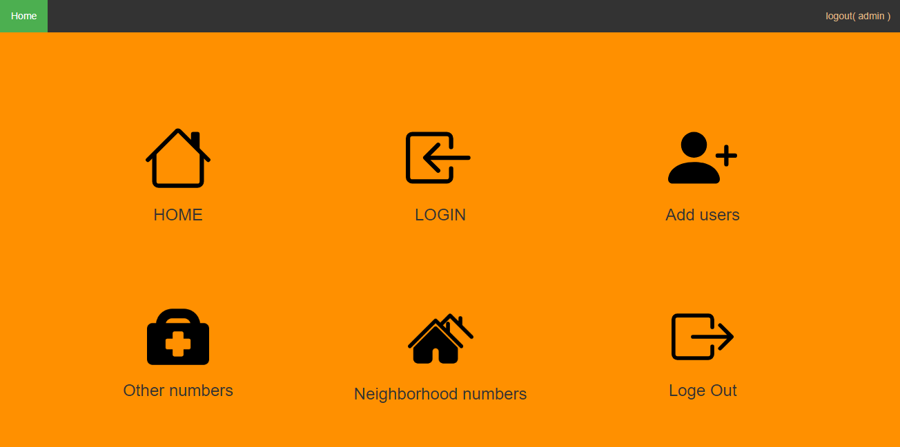

# Residents
The project is a website that residents can use.
Due to potential emergencies that may occur to your neighbors, like a fire incident where the door is closed, the website will allow them to access the phone numbers of all residents in the same building.
The website also provides emergency numbers and postal codes. Additionally, it offers the ability to add workers who have provided services to a neighbor, such as a housekeeper or plumber.

  

## Table of Contents

* [Residents](#Residents)
* [Table of Contents](#table-of-contents)
* [Installation](#installation)
* [Features](#features)

## Installation
To install Residents, follow these steps:

1. Create a database named db.
2. Import the database.sql file into the db database.
3. Clone the repository: git clone git@github.com:aymaneatigui/Residents.git.
4. Navigate to the project directory: cd Residents.
5. Copy the project to htdocs
6. Start a server: Xampp.
7. Access the Preregister web application by opening a web browser and going to http://localhost:3000.

## Features

* Intuitive and user-friendly interface for residents, ensuring ease of use.
* Streamlined registration process for new residents.
* Enhanced customization options for residents to modify personal information.
* Advanced administrative tools for efficient resident database management.
* Customizable information display options for administrators.
* Integration with external systems for exporting resident data in various formats.
* Multi-level access control for administrators based on roles and responsibilities.
* Enhanced security measures to protect resident information and ensure data privacy.
* Interactive community forums or discussion boards for resident engagement.
* Integration with emergency services for quick access to contact information or assistance.
* Collaboration features for residents to communicate and coordinate on neighborhood initiatives or shared resources.

